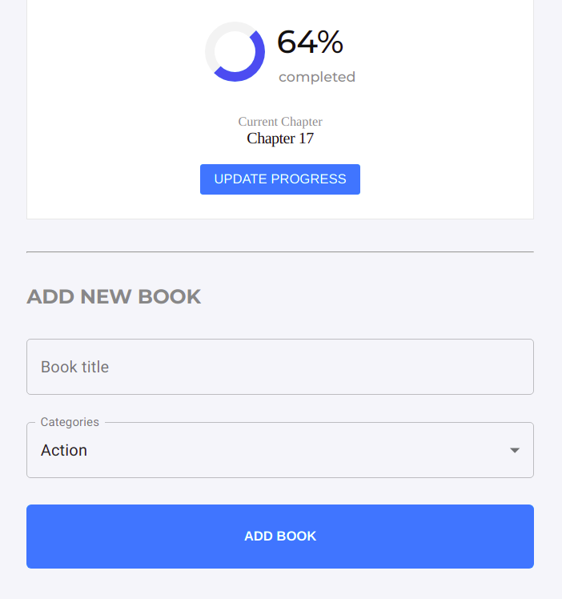

# React Redux Magic Books

A basic book store app developed using React and Redux.

## 🔴 Live Demo

**Click [here](https://magicbooks-temesghen.herokuapp.com/) in order to see a Live Demo of this project.**

## Screenshots

### Desktop

### Small Screen Devices

## Project Specification

- [ ] Use create-react-app to initialize a new React app
- [ ] Add prop-types using npm for typechecking props.
- [ ] Use create-react-app-buildpack to deploy the app to Heroku
- [ ] Prepare the directory structure to house components and containers logic separately
- [ ] Implement the App component
- [ ] Implement the BookList component
- [ ] Implement the Book component
- [ ] Implement the BookForm component
- [ ] Define the Redux actions and reducers
- [ ] Initialize the Redux store
- [ ] Make the BooksForm component stateful
- [ ] Connect the REMOVE_BOOK action to the component
- [ ] Enhance the Redux store by adding a new state named filter and add a new filter reducer
- [ ] Implement the CategoryFilter component
- [ ] Keep the filter value in the Redux store
- [ ] Implement the styling of the different components based on a given design

## Built With

- [ ] Node.js
- [ ] React
- [ ] React-DOM
- [ ] React-Create-App
- [ ] Redux
- [ ] React-Redux
- [ ] Material UI
- [ ] Prop-Types
- [ ] ESLint
- [ ] StyleLint
- [ ] Heroku
- [ ] npm
- [ ] CSS
- [ ] ES6

## Author

👤 **Temesghen Tekeste**

- Github: [@temesghentekeste](https://github.com/temesghentekeste)
- Twitter: [@temesghentekes1](https://twitter.com/temesghentekes1)
- Linkedin: [temsghen tekeste](https://www.linkedin.com/in/temesghentekeste/)

## 🤝 Contributing

Contributions, issues and feature requests are welcome!

Feel free to check the [issues page](https://github.com/temesghentekeste/react-redux-magic-books/issues).

## 👍 Show your support

Give a ⭐️ if you like this project!

## :clap: Acknowledgements

- <a href="https://www.microverse.org/" target="_blank">microverse.org</a>
  </a>
